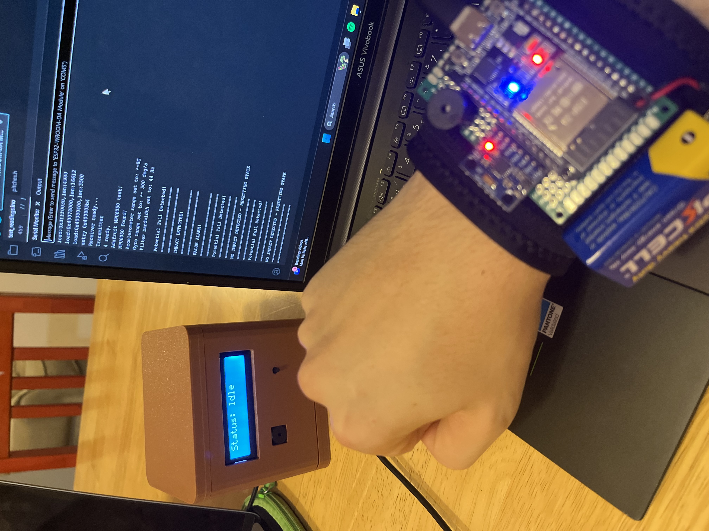
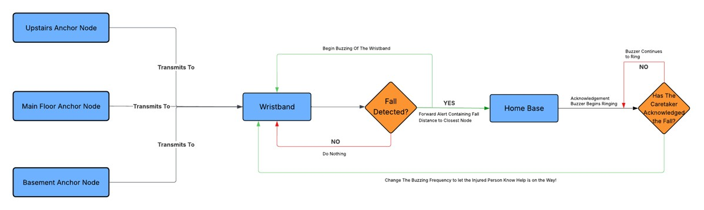
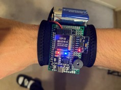
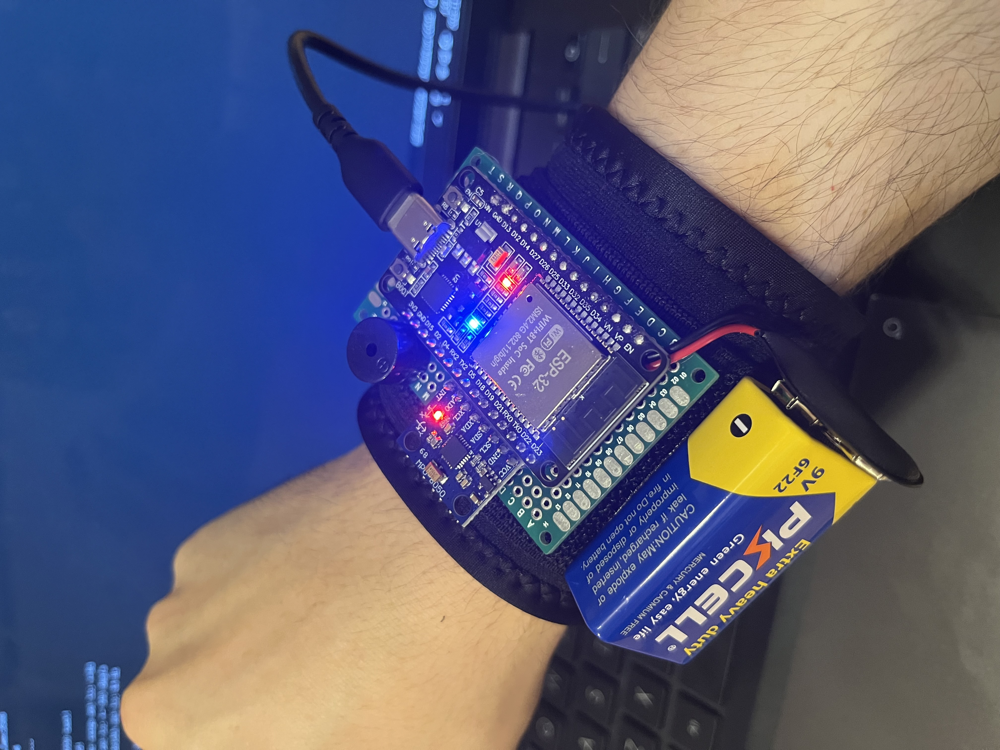
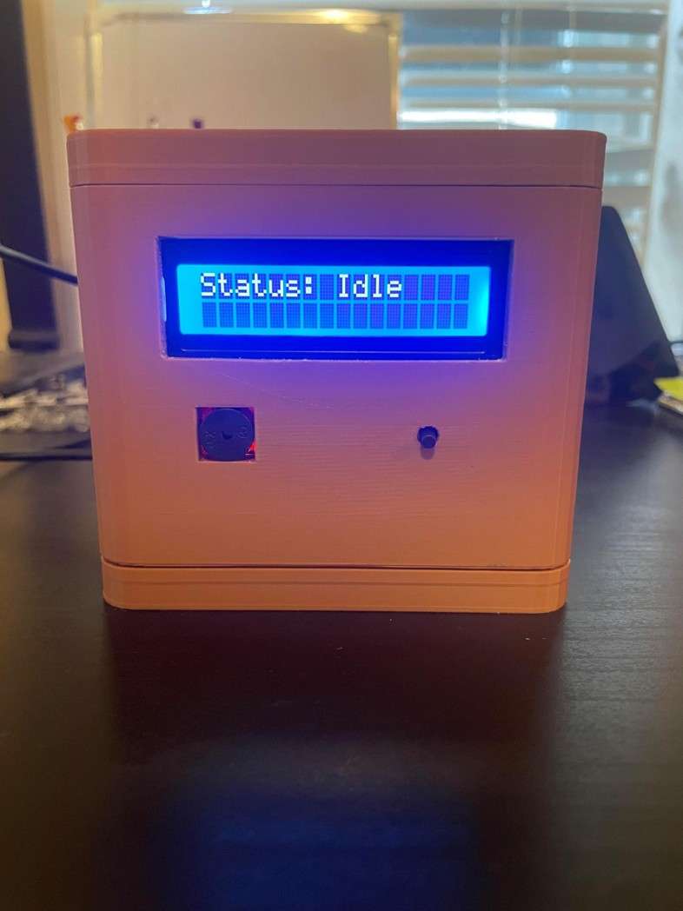

# Fall Detection Wristband

A wireless sensor network (WSN) that detects falls and pinpoints the room they occurred in, alerting a caretaker in real time.

Built for ENGG 4200 — team of 4.

*Placeholder — wristband + base station photo*

---

## Overview

The system pairs a wearable wristband node with fixed anchor nodes placed around a home to detect falls and localize them to a specific room, then alerts a caretaker through a 3D-printed base station.

**My contribution:** *[fill in — e.g. "Owned the wristband hardware and fall-detection algorithm"]*

## Features

- Real-time fall detection using onboard motion sensing
- Room-level localization via RSSI proximity to anchor nodes
- Low-latency, low-power wireless communication (ESP-NOW)
- Base station displays closest room + distance, with audible confirmation back to the wristband

## How it works

1. **Fall detection** — A state machine on the ESP32 distinguishes a real fall (loss of balance → impact → stillness) from normal motion, using an onboard gyroscope/accelerometer.
2. **Localization** — RSSI-based proximity to anchor nodes placed in each room determines where the fall occurred.
3. **Communication** — The wristband, anchor nodes, and base station talk over ESP-NOW for low-latency, low-power wireless transfer.
4. **Alerting** — The base station displays the closest room and distance to the caretaker. An acknowledgment triggers an audible confirmation on the wristband.

*Placeholder — block diagram: wristband → anchor nodes → base station*

## Hardware

| Component | Details |
|---|---|
| Wristband node | Custom PCB, ESP32, gyroscope/accelerometer |
| Anchor nodes | Placed per room, RSSI beacon |
| Base station | 3D-printed enclosure, room + distance display |

  
  
  

*Placeholders — PCB layout, wristband build, base station*

## Results

- Successfully detected simulated falls and correctly localized them to the right room in testing.
- Base station reliably displayed the closest room and distance, with audible confirmation on the wristband.

## Tech stack

`ESP32` · `ESP-NOW` · `Custom PCB` · `Gyroscope/accelerometer` · `3D-printed enclosure`

## Team

4-person team, ENGG 4200.

## License

*[Add a license if you want this public — MIT is a common default for student projects.]*
